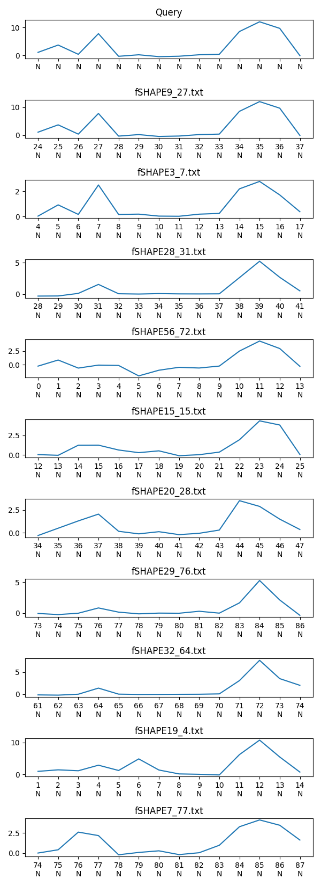

# find-query

This script looks for a given SHAPE or fSHAPE matrix profile in a set of input files.

# Input

The query and all other input files have the same file format in which every line has three columns:

```
fSHAPE          Sequence  SHAPE
```

For example:

```
0.531188539549  T         0.822363
0.279392225779  T         0.714092
1.41084255243   G         1.46544
...
```

The `Sequence` and `SHAPE` columns are optional. If absent, their default values will be `N` and `NaN` respectively.

# Usage

```
./find-query.py --query PATH-TO-QUERY-FILE PATH-TO-INPUT-1 PATH-TO-INPUT-2 ...
```

Example:

```
./find-query.py --query fshape-true-pattern.txt fshape-inputs/*
```

# How it works

1. Compute [matrix profile](https://pypi.org/project/matrixprofile/) for every input with the window size equal to the length of the query
2. Discover up to 10 motifs in every input file
3. Filter out any motifs with `NaN` (Not-a-Number) value inside
4. Sort the motifs according to the Z-normalized Euclidean distance

# Output

## Table

The script creates two CSV files with the following columns:

- _Sample_: name of the input file the motif comes from
- _Range_: indicies of nucleotides in the input file where the motif was found
- _Sequence_: sequence of the motif
- _Z-normalized_: the Z-normalized Euclidean distance of the motif to the query
- _Distance_: a regular euclidean distance of the motif to the query
- _Sequence-Score_: an integer representing similarity (higher is better) of the motif sequence to query sequence
- _fSHAPE-n_: fSHAPE value for every nucleotide in the motif
- _SHAPE-n_: SHAPE value for every nucleotide in the motif

The `output.csv` contains all results, while `output-filtered.csv` may have some of the motifs filtered out. In the latter case, motif is discarded if there is a strong discrepancy for any of its nucleotides (i.e. if the query requests it to be a strong signal, but the motif does not show it).

The result usually requires manual curation. The table is sorted according to the _Z-normalized_ column, but it is just a starting point and user should take into account _Distance_ and _Sequence-Score_ as well when selecting the matches.

## Plots

The script creates two plots:

- `motifs-highlighted.png` is a plot of the 10 best input files with the motif highlighted
- `motifs-only.png` is a plot of the 10 best motifs only (the remaining context is not shown)

# Example for iron-responsive element (IRE)

The query is located in `IRE-dataset/fSHAPE_true_pattern.txt`. All other files in `IRE-dataset/` are inputs.

Usage:

```
$ cd RBPchallenge2021_time_series/
$ find-query/find-query.py --query IRE-dataset/fSHAPE_true_pattern.txt IRE-dataset/fSHAPE[^_]*
```

This will generate `output.csv` with 59 matches. The 10 best are shown here: (`Sequence`, `Sequence-Score` and `SHAPE-n` columns are omitted as they are not used in this example)

| Sample      | Range | Z-normalized     | Distance         | fSHAPE-1         | fSHAPE-2         | fSHAPE-3          | fSHAPE-4         | fSHAPE-5        | fSHAPE-6         | fSHAPE-7         | fSHAPE-8          | fSHAPE-9         | fSHAPE-10       | fSHAPE-11     | fSHAPE-12     | fSHAPE-13     | fSHAPE-14       |
| ----------- | ----- | ---------------- | ---------------- | ---------------- | ---------------- | ----------------- | ---------------- | --------------- | ---------------- | ---------------- | ----------------- | ---------------- | --------------- | ------------- | ------------- | ------------- | --------------- |
| fSHAPE9_27  | 24-38 | 0                | 0                | 1,06772853673    | 3,68963759145    | 0,367863193024    | 7,76898974124    | -0,341646055133 | 0,202713454415   | -0,46180713913   | -0,315838427199   | 0,205393336247   | 0,379053117648  | 8,53297391057 | 12,0168919056 | 9,66345727682 | -0,103275883462 |
| fSHAPE3_7   | 4-18  | 1,01149721451335 | 15,0530808956911 | 0,0293133441014  | 0,91707458433    | 0,162426439207    | 2,4920985582     | 0,160423302896  | 0,185049974565   | 0,0287738507126  | 0,0165892193364   | 0,182076048383   | 0,241625005214  | 2,18502843961 | 2,7732428618  | 1,70427460972 | 0,375269986821  |
| fSHAPE28_31 | 28-42 | 1,60874725643843 | 13,6766318762732 | -0,298496806623  | -0,28231995877   | 0,128385341809    | 1,55372337924    | 0,0707351808822 | 0,0247337447811  | 0,0933806243402  | 0,0505078571593   | 0,0427855290214  | 0,0577737392995 | 2,63388538256 | 5,23513782096 | 2,68085952669 | 0,527921629356  |
| fSHAPE56_72 | 0-14  | 1,75541284106692 | 14,7834802880223 | -0,233248892876  | 0,872386544009   | -0,590932553493   | -0,0512275394473 | -0,112882522404 | -2,00864142973   | -0,981846811559  | -0,451446650476   | -0,578375365185  | -0,224733915387 | 2,50032324392 | 4,31855793676 | 2,95896691276 | -0,274269738111 |
| fSHAPE15_15 | 12-26 | 1,91133837587146 | 14,0244651883054 | 0,0305139634467  | -0,0588374898353 | 1,23807403242     | 1,24313210273    | 0,621025639162  | 0,281168366163   | 0,513144502555   | -0,109914654032   | 0,0199199725736  | 0,348835207361  | 1,93536360756 | 4,35935549445 | 3,82696533189 | 0,0469070325031 |
| fSHAPE20_28 | 34-48 | 1,96586830751513 | 14,8681579574227 | -0,300436671739  | 0,50527669966    | 1,30861582001     | 2,05750198807    | 0,164871913398  | -0,118011390862  | 0,120474838124   | -0,203506850377   | -0,0560588958935 | 0,298981712988  | 3,53822657457 | 2,90614732405 | 1,50334821675 | 0,363169123749  |
| fSHAPE29_76 | 73-87 | 2,00919063779288 | 14,6324363933594 | -0,0423804587754 | -0,221118792978  | -0,00250914739191 | 0,853353619431   | 0,17248088399   | -0,104717438203  | 0,0170167915802  | -0,00634175640973 | 0,314388814924   | 0,0109839427912 | 1,67445486176 | 5,29995246737 | 2,14195273289 | -0,343678422088 |
| fSHAPE32_64 | 61-75 | 2,08237130561257 | 12,1803633685753 | -0,145536448756  | -0,200896086913  | 0,0106453487874   | 1,39126379903    | 0,0271233578403 | -0,0437719877333 | -0,0342226039048 | -0,0115929850103  | 0,00339119146214 | 0,0830096751139 | 3,09486047237 | 7,68768193629 | 3,53750238745 | 2,01968157862   |
| fSHAPE19_4  | 1-15  | 2,12340761616528 | 9,10979647127597 | 0,96820796581    | 1,43783505875    | 1,15179206587     | 2,89301332487    | 1,23942901573   | 4,8689906345     | 1,38478226266    | 0,162617929756    | 0,0435137280858  | -0,165595153705 | 6,21311517039 | 10,7578414713 | 5,46672509047 | 0,735215559673  |
| fSHAPE7_77  | 74-88 | 2,14255269147486 | 13,4094084910305 | 0,00432218275865 | 0,412292280774   | 2,62026185509     | 2,18582283455    | -0,212247821923 | 0,0794062713526  | 0,28110684812    | -0,191820298368   | 0,043094391577   | 0,975413677298  | 3,29172541845 | 4,14450644729 | 3,47784938254 | 1,63086297483   |

The visualization of the best 10 matches looks like this:


